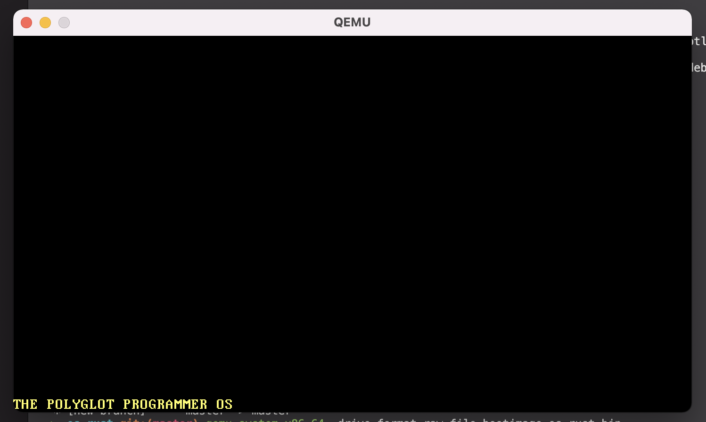

The Polyglot Programmer OS in Rust
===
My own Operating System, just for fun.

> What I cannot create, I do not understand. 
> — Richard Feynman

## Requirements
* [QEMU](https://www.qemu.org/)
*  Rust 1.52.0-nightly

## Important Notes

To create a bootable image we just need to hit one command which is:
```
> cargo bootimage
```

To run our bootable image we need to hit a command provided by QEMU which is:
```
> qemu-system-x86_64 -drive format=raw,file=bootimage-os_rust.bin
```


#### Code based on: 
* https://blog.knoldus.com/os-in-rust-an-executable-that-runs-on-bare-metal-part-1/
* https://blog.knoldus.com/os-in-rust-an-executable-that-runs-on-bare-metal-part-2/
* https://blog.knoldus.com/os-in-rust-custom-target-to-build-kernel-for-a-bare-metal-part-3/
* https://blog.knoldus.com/os-in-rust-building-kernel-for-custom-target-part-4/
* https://blog.knoldus.com/os-in-rust-running-our-custom-kernel-on-an-emulator-part-5/
* https://blog.knoldus.com/os-in-rust-incorporate-vga-buffer-part-6/
* https://blog.knoldus.com/os-in-rust-incorporate-vga-buffer-part-7/
* https://os.phil-opp.com/